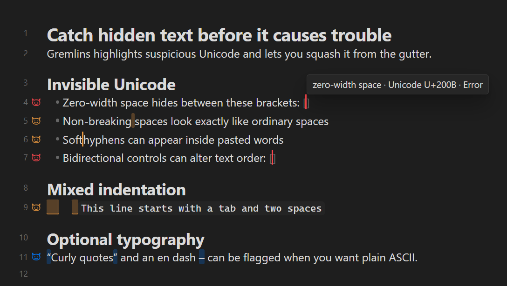

https://github.com/user-attachments/assets/809503f0-1a39-4567-91f3-258359d5f146

# Gremlins for Obsidian

Gremlins reveal invisible characters (inluding curly quations marks and em dashes).

Lightweight and loads under `1ms` on most systems.
Can sit in the background - just load and forget.
If you ever paste something that has many unicodes, Gremlins flag them. To replace every flagged character on a line, simply squash the Gremlin by clicking its gutter icon.

## Features

- Flags invisible or unusual Unicode characters, mixed indentation, and optionally typographic punctuation (curly quotation marks and en dashes). See details below.
- Shows an icon beside every visible line containing a gremlin (optionally, you can click the icon to fix the character immediatly)
- Works in Source mode and Live Preview.

## The plugin checks three groups of rules.

### 1. Invisible or potentially dangerous Unicode — enabled by default

| Unicode | Character | Fix when explicitly requested |
|---|---|---|
| `U+0003` | End of text control | Delete |
| `U+000B` | Line tabulation/vertical tab | Newline |
| `U+00A0` | Non-breaking space | Ordinary space |
| `U+00AD` | Soft hyphen | Delete |
| `U+180E` | Mongolian vowel separator | Delete |
| `U+2007` | Figure space | Ordinary space |
| `U+200B` | Zero-width space | Delete |
| `U+200C` | Zero-width non-joiner | Delete |
| `U+200E` | Left-to-right mark | Delete |
| `U+200F` | Right-to-left mark | Delete |
| `U+2028` | Unicode line separator | Newline |
| `U+2029` | Unicode paragraph separator | Blank line |
| `U+202A–U+202E` | Bidirectional embedding/override controls | Delete |
| `U+202F` | Narrow non-breaking space | Ordinary space |
| `U+2060` | Word joiner | Delete |
| `U+2066–U+2069` | Bidirectional isolate controls | Delete |
| `U+FEFF` | Zero-width no-break space/BOM | Delete |
| `U+FFFC` | Object replacement character | Delete |

Bidirectional controls and invisible characters are highlighted because they can make text appear different from its actual stored order or produce confusing Markdown, searches, and diffs.

### 2. Mixed indentation - enabled by default

It detects indentation at the beginning of a line containing **both tabs and spaces**.

When fixed, the indentation becomes spaces while preserving its visual width, assuming four-column tab stops.

It does **not** flag indentation made entirely from tabs or entirely from spaces.

### 3. Typographic punctuation - disabled by default

| Unicode | Character | Optional replacement |
|---|---|---|
| `U+2013` | En dash `–` | Hyphen `-` |
| `U+2018` / `U+2019` | Curly single quotes `‘ ’` | Straight apostrophe `'` |
| `U+201C` / `U+201D` | Curly double quotes `“ ”` | Straight quote `"` |

## Important

The plugin does **not automatically replace anything**:

- **Click gutter icons to fix** is disabled by default.
- Without it, Gremlins only highlights and explains characters.

## Inspiration

This plugin is independently implemented for Obsidian and inspired by [Gremlins tracker for Visual Studio Code](https://github.com/nhoizey/vscode-gremlins), released under the MIT License by Nicolas Hoizey.
