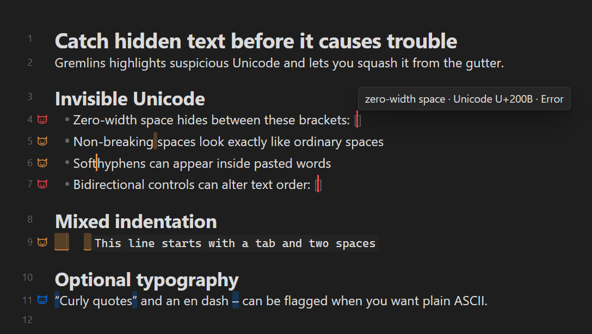

https://github.com/user-attachments/assets/809503f0-1a39-4567-91f3-258359d5f146

# Gremlins for Obsidian

Gremlins reveal invisible characters (inluding curly quations marks and em dashes).

Lightweight and loads under `1ms` on most systems.  
Can sit in the background - just load and forget.  
If you ever paste something that has many unicodes, Gremlins flag them. To replace every flagged character on a line, simply squash the Gremlin by clicking its gutter icon.  

## Features

- Flags invisible or unusual Unicode characters, mixed indentation, malformed list structure and spacing, inconsistent list-item punctuation and line endings, plus optional typographic punctuation (curly quotation marks, en dashes, and em dashes). See details below.
- Shows an icon beside every visible line containing a gremlin (optionally, you can click the icon to fix the character immediatly)
- Works in Source mode and Live Preview.

## The plugin checks ten groups of rules.

### 1. Invisible or potentially dangerous Unicode - enabled by default

| Unicode | Character | Fix when explicitly requested |
|---|---|---|
| `U+0003` | End of text control | Delete |
| `U+000B` | Line tabulation/vertical tab | Newline |
| `U+00A0` | Non-breaking space | Ordinary space |
| `U+00AD` | Soft hyphen | Delete |
| `U+180E` | Mongolian vowel separator | Delete |
| `U+2007` | Figure space | Ordinary space |
| `U+200B` | Zero-width space | Delete |
| `U+200C` | Zero-width non-joiner | Delete |
| `U+200E` | Left-to-right mark | Delete |
| `U+200F` | Right-to-left mark | Delete |
| `U+2028` | Unicode line separator | Newline |
| `U+2029` | Unicode paragraph separator | Blank line |
| `U+202A–U+202E` | Bidirectional embedding/override controls | Delete |
| `U+202F` | Narrow non-breaking space | Ordinary space |
| `U+2060` | Word joiner | Delete |
| `U+2066–U+2069` | Bidirectional isolate controls | Delete |
| `U+FEFF` | Zero-width no-break space/BOM | Delete |
| `U+FFFC` | Object replacement character | Delete |

Bidirectional controls and invisible characters are highlighted because they can make text appear different from its actual stored order or produce confusing Markdown, searches, and diffs.

### 2. Mixed indentation - enabled by default

It detects indentation at the beginning of a line containing **both tabs and spaces**.

When fixed, mixed indentation is rounded to the nearest level using Obsidian's current **Indent visual width**, with ties rounded to the deeper level. Tab-led indentation remains tabs, while space-led indentation becomes spaces. For a four-space indent width, one tab followed by one space becomes one tab, while one tab followed by two, three, or four spaces becomes two tabs.

It does **not** flag indentation made entirely from tabs or entirely from spaces.

### 3. List indentation - disabled by default

It detects space-indented Markdown list items whose indentation is not a multiple of Obsidian's current **Indent visual width** setting. It also detects space- or tab-indented list markers that have no parent list item, including list-shaped lines that Markdown parses as indented code. Unordered, ordered, and task list items are supported; ordinary indented prose and fenced or inline code are ignored.

Markdown cannot distinguish an accidentally four-space-indented list from indented code containing the same text. Intentional indented-code lines beginning with list markers are therefore also highlighted when this opt-in rule is enabled.

When fixed, an orphaned list marker dedents its entire contiguous indented block by the shared minimum indentation in one edit. This preserves deeper children and continuation lines; blank or unindented lines delimit the block. Other malformed indentation is rounded to the nearest level, with ties rounded to the deeper level. For a four-space indent width, one space becomes no indentation, two or three spaces become four, five spaces becomes four, and six or seven spaces become eight.

Fixes retain relative visual indentation and prefer each line's existing tab- or space-led style.

### 4. Duplicate list markers - disabled by default

This rule detects consecutive unordered list markers before item content on one source line, such as `- - Detect double bullets`. Markdown renders these as nested lists, which can hide an accidental duplicate marker. Blockquotes and nested lists are supported; literal Markdown regions, thematic breaks, and marker-only lines are ignored.

When fixed, Gremlins removes the first marker and its following whitespace, producing `- Detect double bullets`. Because compact nested-list syntax can be intentional, this rule is opt-in.

### 5. List marker spacing - disabled by default

This rule detects unordered and ordered list markers followed by anything other than one ordinary space, such as `-  Detect space`, `1.  Detect space`, or a tab-delimited item. It also checks each marker in compact nested-list syntax. Literal Markdown regions, thematic breaks, and potential Setext underlines are ignored.

When fixed, Gremlins replaces the marker delimiter with one ordinary space. Multiple spaces are valid Markdown and can sometimes be intentional, so this rule is opt-in.

### 6. Ambiguous empty list markers - disabled by default

This conservative rule detects a lone hyphen with no following space when surrounding list structure strongly suggests that it is intended as an empty list item. The following line must be a dash list item at the same indentation, while the preceding line must be either its parent list item or a same-level dash item. The same pattern is supported inside blockquotes and callouts. Ordinary Setext headings and literal Markdown regions are ignored.

Without a trailing space, Obsidian may treat the hyphen as a Setext level-two heading underline and parse the preceding list text as a heading. When fixed, Gremlins inserts one ordinary space after the hyphen so Obsidian parses it as an explicit empty list item. Because an intentional heading inside a list is still technically possible, this rule is opt-in.

### 7. Missing list markers - disabled by default

This conservative rule detects a pasted-list pattern where a prose line is exactly one indent level shallower than the preceding list item while the next line is an unordered list item exactly one level deeper than that preceding item. This indicates that the prose line may have lost its list marker and indentation. Ordinary continuation text indented beneath its parent is ignored.

When fixed, the line is aligned with the following list item and receives the same unordered marker (`-`, `+`, or `*`). Because this changes Markdown structure based on a heuristic, the rule is opt-in and never fixes text automatically.

### 8. List item punctuation - disabled by default

This rule can require no terminal punctuation, periods, semicolons, or semicolons followed by a period on the final item. It can also infer the dominant style independently for each contiguous list and nested level; when styles are tied, the first item decides. The conventional semicolon/final-period pattern is recognized automatically.

Ordered, unordered, task, nested, multiline, and blockquoted list items are supported. For multiline items, the final content line is checked. Meaningful sentence endings—question marks, exclamation marks, ellipses, and Unicode equivalents—are preserved under every policy and excluded from automatic inference, including when they appear before a closing quotation mark. The period policy does not require a period after an item consisting only of an Obsidian wikilink or a single-token all-caps label. It also leaves an unpunctuated marker-line parent unchanged when that item introduces a nested list. Parent colons that introduce nested lists and display-math endings (`$$`) are treated as structural and left unchanged. Fenced code, frontmatter, and other parser-recognized literal Markdown are ignored.

When fixed, Gremlins inserts, replaces, or removes the terminal punctuation selected for that list.

### 9. List item line endings - disabled by default

This rule offers three policies: remove trailing whitespace, require exactly two ordinary trailing spaces for a Markdown hard break, or require a blank line between sibling list items. The hard-break policy skips parent items that introduce nested lists and items ending in display math because they already render as separate blocks. It also skips lines ending in Obsidian block IDs because trailing spaces would invalidate the block reference. Blank-line fixes are placed after a nested subtree so the parent list structure is preserved.

When fixed, Gremlins normalizes only the selected line-ending behavior. The final list item is not given an extra blank separator.

### 10. Typographic punctuation - disabled by default

| Unicode | Character | Optional replacement |
|---|---|---|
| `U+2013` | En dash `–` | Hyphen `-` |
| `U+2014` | Em dash `—` | Hyphen `-` |
| `U+2018` / `U+2019` | Curly single quotes `‘ ’` | Straight apostrophe `'` |
| `U+201C` / `U+201D` | Curly double quotes `“ ”` | Straight quote `"` |

## Fix a code block

With **Gutter icons** and **Click gutter icons to fix** enabled, a larger bug button appears beside the opening fence of a code block that contains fixable gremlins. Click it to apply the enabled character and mixed-indentation fixes throughout that block, including lines outside the viewport. Markdown list-formatting rules are not applied to code.

The block is changed in one editor transaction, so one Undo restores it. Visible line icons play the existing explosion animation from top to bottom; reduced-motion preferences disable the animation. Individual line icons continue to work as before. The larger button can also be focused with Tab and activated with Enter or Space.

This feature supports ordinary backtick and tilde fences and fences in blockquotes, including an unfinished final fence. It does not add a button for indented code or list-nested fences indented by four or more spaces. It is available in the editor (Source mode and Live Preview), not Reading view.

## Important

The plugin does **not automatically replace anything**:

- **Click gutter icons to fix** is disabled by default.
- Without it, Gremlins only highlights and explains characters or list-formatting inconsistencies.

## Inspiration

This plugin is independently implemented for Obsidian and inspired by [Gremlins tracker for Visual Studio Code](https://github.com/nhoizey/vscode-gremlins), released under the MIT License by Nicolas Hoizey.
